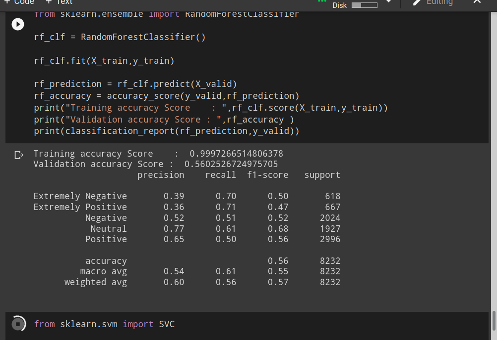
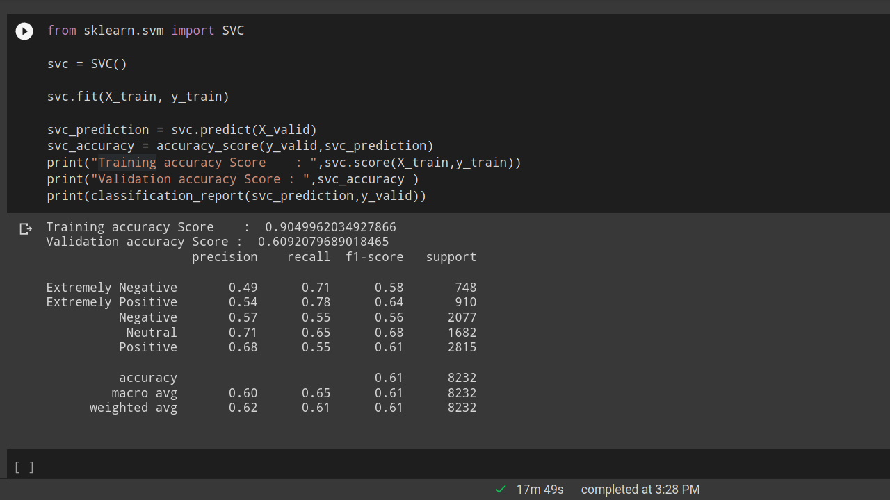
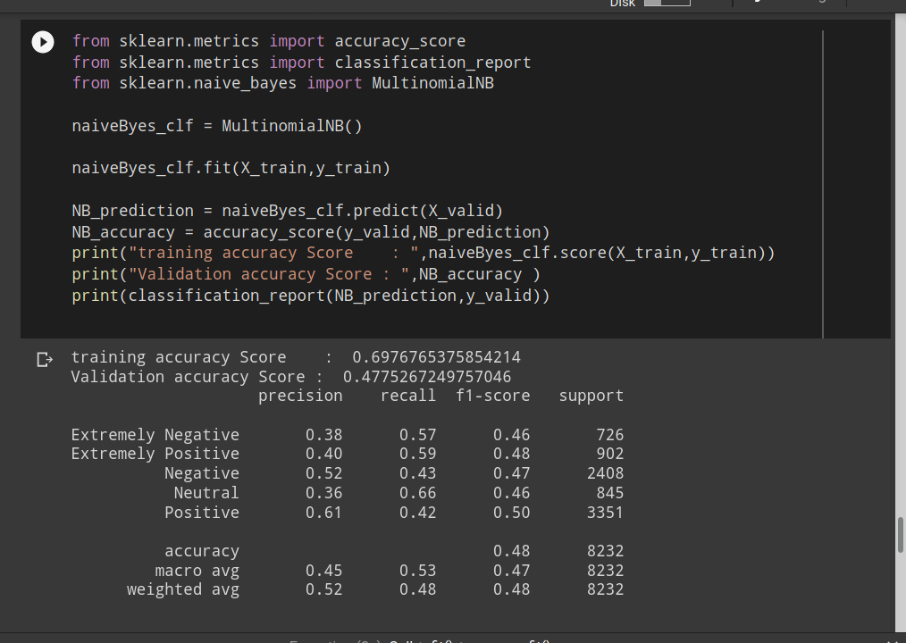
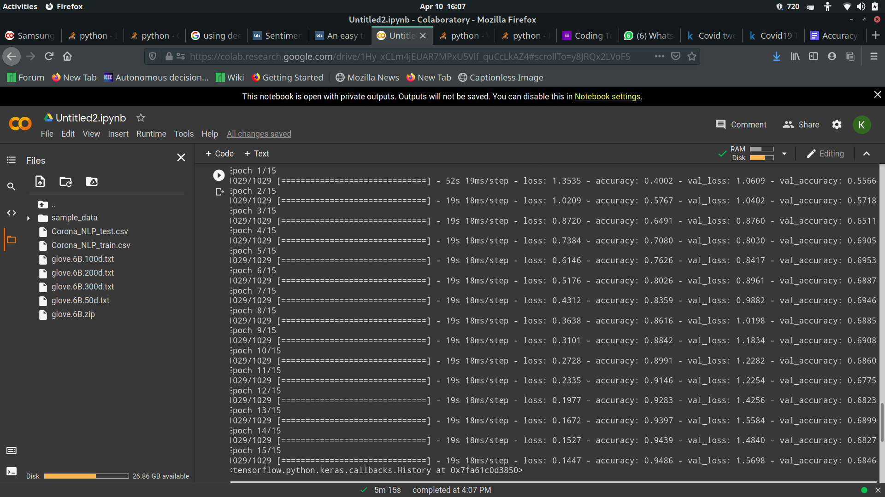

# Sentiment-Analysis
***
## Introduction
Sentiment analysis is the process of detecting positive or negative sentiment in text. It’s often used by businesses to detect sentiment in social data, gauge brand reputation, and understand customers.
***
## Data And Classification
Here I have made use of covid-19 tweets as our dataset.
I have classified the tweets into 5 classes namely:-
1. Extremely Positive
2. Positive
3. Neutral
4. Negative
5. Extremely Negative
***
## Machine Learning Models
I have compared the given dataset with 3 machine learning models and have found their training accuracy, validation accuracy and the classification report respectively.
The models used are
1. Naive Bayes Classifier
2. Random Forest Classifier
3. SVM Classifier

### Output screenshots
1. Naive Bayes

2.Random Forest

3.SVM

***
## Deep Learning Model
I have used Glove vector embedding and LSTM model for training the dataset. Out here the deep learning model out performs all the other models as it uses word embedding of Glove
word embeddings which is trained on way more data and is highly efficient.

### Output screenshots
1. Model

***

## Conclusion
Feel free to play around with the code!!

